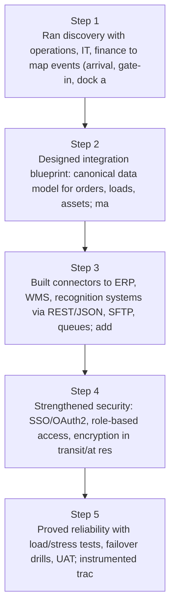
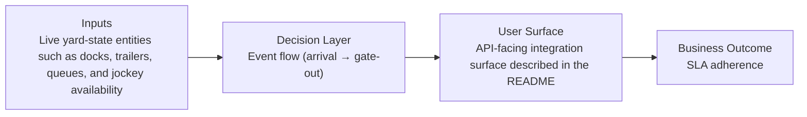
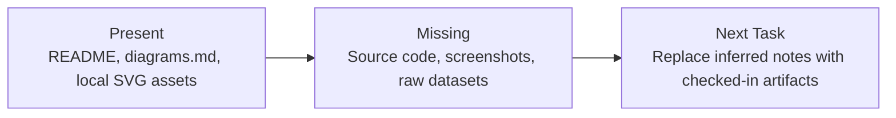

# Enterprise YMS Integration Diagrams

Generated on 2026-04-26T04:29:37Z from README narrative plus project blueprint requirements.

## Integration architecture diagram

## Event flow (arrival → gate-out)

## Evidence Gap Map

